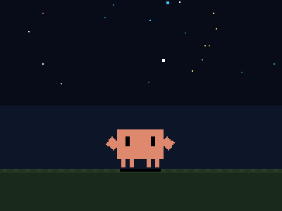
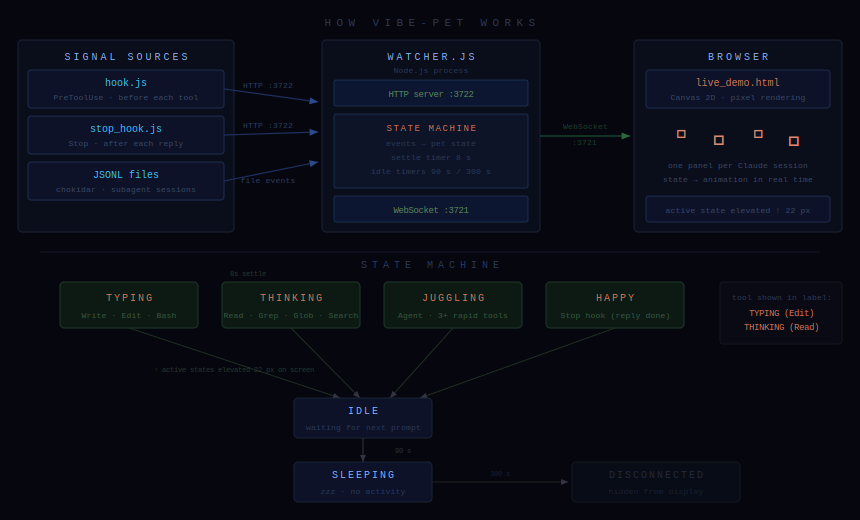

# 🐾 Vibe Pet

<p align="center">
  
</p>

A pixel-art companion that lives in your browser and reacts to what Claude Code is doing — in real time.

One panel appears per active Claude Code session. When Claude is typing, your pet types. When Claude is thinking, it stares into the void. When it's done, it throws its arms up.



---

## States

| State | Trigger | Animation |
|:------|:--------|:----------|
| `TYPING (tool)` | Write / Edit / Bash | Typing on laptop, data particles fly |
| `THINKING (tool)` | Read / Grep / Glob / WebSearch | Eyes look up, thought bubble |
| `JUGGLING` | Agent tool or 3+ rapid tools | Juggles colorful balls |
| `HAPPY` | Reply sent (Stop hook) | Arms up, sparkles |
| `READY` | Waiting for next prompt | Arms wide, relaxed breathing |
| `SLEEPING` | 90 s no activity | Eyes closed, zzz floats |
| `DISCONNECTED` | 300 s no activity | Hidden from display |

Active states (`TYPING`, `THINKING`, `JUGGLING`) are elevated 22 px above idle ones.
The current tool name is shown in parentheses: `TYPING (Edit)`, `THINKING (Read)`.

---

## Quick Start

### 1. Run the watcher

```bash
cd vibe-pet/live
npm install
node watcher.js
```

This starts two servers:
- **HTTP `:3722`** — receives hook events from Claude Code
- **WebSocket `:3721`** — pushes state updates to the browser

### 2. Open the live demo

Open `vibe-pet/live_demo.html` in your browser (no server needed — it's a static file).

### 3. Install hooks into Claude Code

Add to `~/.claude/settings.json` (adjust the path to match your machine):

```json
{
  "hooks": {
    "PreToolUse": [{
      "matcher": "*",
      "hooks": [{ "type": "command", "command": "node E:/claude-code/vibe-pet/live/hook.js" }]
    }],
    "Stop": [{
      "hooks": [{ "type": "command", "command": "node E:/claude-code/vibe-pet/live/stop_hook.js" }]
    }],
    "UserPromptSubmit": [{
      "hooks": [{ "type": "command", "command": "node E:/claude-code/vibe-pet/live/bye_hook.js" }]
    }]
  }
}
```

Restart your Claude Code windows for the hooks to take effect.

### 4. Sign off a session

Send `bye` (or `再见`, `goodbye`, `close session`) as your first word in a message. The pet does a little wave and disappears.

---

## How It Works

Three signal sources feed the watcher:

| Source | When | What it tells the watcher |
|:-------|:-----|:--------------------------|
| `hook.js` (PreToolUse) | Before every tool call | Which tool is running |
| `stop_hook.js` (Stop) | After every reply | Turn is done → HAPPY → READY |
| chokidar JSONL watch | Subagent file changes | Sub-agent sessions |

The watcher maintains a **session state machine** per Claude window:

- Each tool call updates the current state and resets an 8-second settle timer
- After 8 s of no new tool calls → `IDLE`
- After 90 s → `SLEEPING`
- After 300 s → `DISCONNECTED` (removed from display)

State is broadcast over WebSocket. The browser renders one canvas panel per session.

---

## File Structure

```
vibe-pet/
├── live_demo.html          ← open this in your browser
├── docs/
│   └── diagram.svg         ← architecture diagram
├── live/
│   ├── watcher.js          ← Node.js server (HTTP + WebSocket + chokidar)
│   ├── hook.js             ← PreToolUse hook
│   ├── stop_hook.js        ← Stop hook
│   ├── bye_hook.js         ← UserPromptSubmit hook (bye detection)
│   └── package.json
└── examples/
    └── crab_floating.html  ← standalone pixel animation demo
```

---

## Requirements

- Node.js 18+
- Claude Code with hooks support
- A browser (no server needed for `live_demo.html`)
